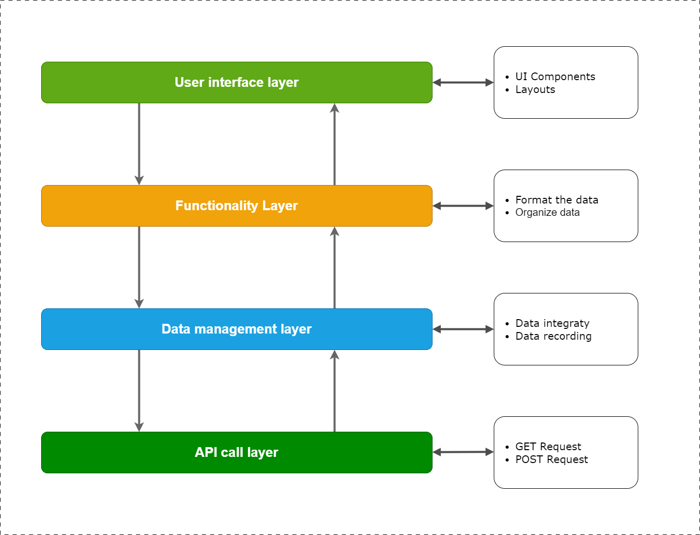
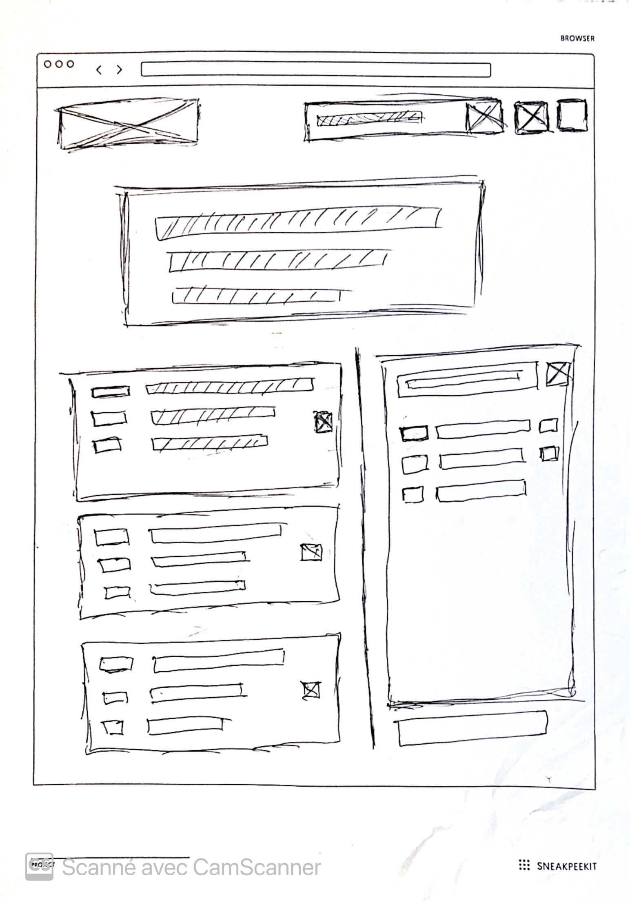

# Trackist

Tracklist is a custom playlist manager

## Trackist System


## Architecture



## Wireframe


## Library

### Tailwindcss

```
npm install -D tailwindcss

npx tailwindcss init
```

`tailwind.config.js`
```js
/** @type {import('tailwindcss').Config} */
module.exports = {
  content: [
    "./src/**/*.{js,jsx,ts,tsx}",
  ],
  theme: {
    extend: {},
  },
  plugins: [],
}
```

`Index.css`
```css
@tailwind base;
@tailwind components;
@tailwind utilities;
```

### Fontawesome
----------

#### Importation individuelle d'icones

```
npm i @fortawesome/react-fontawesome

npm i @fortawesome/free-solid-svg-icons

npm i @fortawesome/free-regular-svg-icons
```

#### Usage
```js
import { FontAwesomeIcon } from '@fortawesome/react-fontawesome'
import { faEnvelope } from '@fortawesome/free-solid-svg-icons'

<FontAwesomeIcon icon={faEnvelope} />
```
